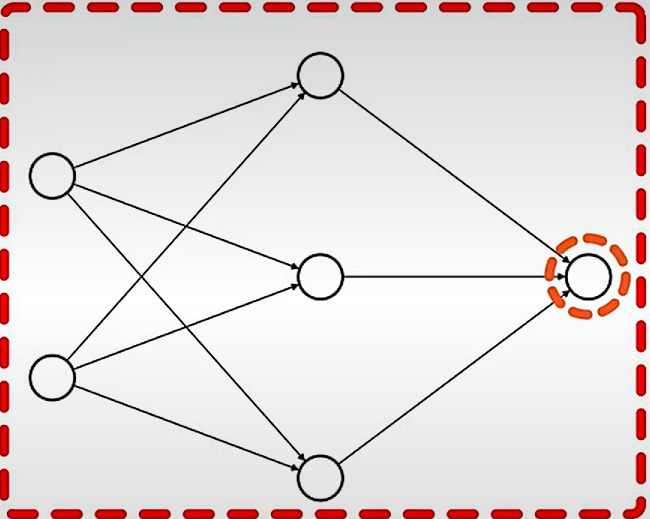

# 前馈神经网络原理详解与示例

## 1. 前馈神经网络概述

前馈神经网络（Feedforward Neural Network，FNN）是最基本的神经网络结构。信息从输入层单向流向输出层，中间没有反馈连接。它通过多层非线性变换将输入映射到输出，是深度学习的基础。

## 2. 网络结构与符号定义

### 2.1 三层前馈神经网络示例

考虑一个简单的三层神经网络：
- **输入层**：2个神经元（特征）
- **隐藏层**：3个神经元
- **输出层**：1个神经元

网络结构：输入层 → 隐藏层 → 输出层

### 2.2 数学符号定义
- 输入向量：$ x = [x_1, x_2]^T $
- 隐藏层：
  - 权重矩阵：$ W^{(1)} \in \mathbb{R}^{3 \times 2} $
  - 偏置向量：$ b^{(1)} \in \mathbb{R}^{3} $
  - 激活前：$ z^{(1)} \in \mathbb{R}^{3} $
  - 激活后：$ a^{(1)} \in \mathbb{R}^{3} $
- 输出层：
  - 权重矩阵：$ W^{(2)} \in \mathbb{R}^{1 \times 3} $
  - 偏置向量：$ b^{(2)} \in \mathbb{R}^{1} $
  - 激活前：$ z^{(2)} \in \mathbb{R}^{1} $
  - 激活后：$ a^{(2)} \in \mathbb{R}^{1} $（即最终输出）
- 激活函数：隐藏层使用ReLU，输出层使用sigmoid（二分类问题）

## 3. 具体数值示例

### 3.1 初始化参数
假设我们随机初始化参数（实际中会使用更好的初始化方法）：

**输入数据**：
$$
x = \begin{bmatrix} 1.0 \\ 0.5 \end{bmatrix}
$$

**第一层参数**：
$$
W^{(1)} = \begin{bmatrix} 
0.1 & 0.2 \\
0.3 & 0.4 \\
0.5 & 0.6 
\end{bmatrix}, \quad
b^{(1)} = \begin{bmatrix} 0.1 \\ 0.2 \\ 0.3 \end{bmatrix}
$$

**第二层参数**：
$$
W^{(2)} = \begin{bmatrix} 0.7 & 0.8 & 0.9 \end{bmatrix}, \quad
b^{(2)} = \begin{bmatrix} 0.4 \end{bmatrix}
$$

### 3.2 前向传播计算

#### 步骤1：输入层到隐藏层
计算隐藏层激活前的值：
$$
z^{(1)} = W^{(1)} x + b^{(1)} = 
\begin{bmatrix} 
0.1 & 0.2 \\
0.3 & 0.4 \\
0.5 & 0.6 
\end{bmatrix}
\begin{bmatrix} 1.0 \\ 0.5 \end{bmatrix} +
\begin{bmatrix} 0.1 \\ 0.2 \\ 0.3 \end{bmatrix}
$$

**矩阵乘法**：
- 第一个神经元：$ 0.1 \times 1.0 + 0.2 \times 0.5 = 0.1 + 0.1 = 0.2 $
- 第二个神经元：$ 0.3 \times 1.0 + 0.4 \times 0.5 = 0.3 + 0.2 = 0.5 $
- 第三个神经元：$ 0.5 \times 1.0 + 0.6 \times 0.5 = 0.5 + 0.3 = 0.8 $

**加上偏置**：
$$
z^{(1)} = 
\begin{bmatrix} 0.2 + 0.1 \\ 0.5 + 0.2 \\ 0.8 + 0.3 \end{bmatrix} = 
\begin{bmatrix} 0.3 \\ 0.7 \\ 1.1 \end{bmatrix}
$$

#### 步骤2：应用激活函数（ReLU）
ReLU函数：$ \text{ReLU}(z) = \max(0, z) $

$$
a^{(1)} = \text{ReLU}(z^{(1)}) = \text{ReLU}\left(
\begin{bmatrix} 0.3 \\ 0.7 \\ 1.1 \end{bmatrix}
\right) = 
\begin{bmatrix} 0.3 \\ 0.7 \\ 1.1 \end{bmatrix}
$$
（所有值都大于0，所以保持不变）

#### 步骤3：隐藏层到输出层
计算输出层激活前的值：
$$
z^{(2)} = W^{(2)} a^{(1)} + b^{(2)} = 
\begin{bmatrix} 0.7 & 0.8 & 0.9 \end{bmatrix}
\begin{bmatrix} 0.3 \\ 0.7 \\ 1.1 \end{bmatrix} + 
\begin{bmatrix} 0.4 \end{bmatrix}
$$

**点积计算**：
$ 0.7 \times 0.3 + 0.8 \times 0.7 + 0.9 \times 1.1 = 0.21 + 0.56 + 0.99 = 1.76 $

$$
z^{(2)} = 1.76 + 0.4 = 2.16
$$

#### 步骤4：输出层激活函数（sigmoid）
sigmoid函数：$ \sigma(z) = \frac{1}{1 + e^{-z}} $

$$
a^{(2)} = \sigma(z^{(2)}) = \sigma(2.16) = \frac{1}{1 + e^{-2.16}} = \frac{1}{1 + 0.115} = \frac{1}{1.115} \approx 0.897
$$

### 3.3 网络输出
对于输入 $ x = [1.0, 0.5]^T $，神经网络的输出为 $ 0.897 $。对于二分类问题（sigmoid输出），这表示输入属于正类的概率为 0.897。

## 4. 前向传播的通用公式

对于具有 L 层的神经网络：

### 4.1 第 l 层的计算
对于 $ l = 1, 2, \dots, L $：
$$
z^{(l)} = W^{(l)} a^{(l-1)} + b^{(l)}
$$
$$
a^{(l)} = g^{(l)}(z^{(l)})
$$

其中：
- $ a^{(0)} = x $（输入）
- $ g^{(l)} $ 是第 l 层的激活函数
- $ a^{(L)} $ 是最终输出

### 4.2 激活函数示例
1. **ReLU**：$ g(z) = \max(0, z) $
2. **Sigmoid**：$ g(z) = \frac{1}{1 + e^{-z}} $
3. **Tanh**：$ g(z) = \frac{e^z - e^{-z}}{e^z + e^{-z}} $
4. **Softmax**（多分类输出层）：$ g(z)_i = \frac{e^{z_i}}{\sum_j e^{z_j}} $

## 5. 反向传播原理

反向传播用于计算损失函数对每个参数的梯度。我们使用交叉熵损失为例。

### 5.1 定义损失函数
假设真实标签为 $ y = 1 $（正类），使用二元交叉熵损失：
$$
L = -\left[ y \log(a^{(2)}) + (1 - y) \log(1 - a^{(2)}) \right] = -\log(0.897) \approx 0.109
$$

### 5.2 反向传播计算梯度

#### 步骤1：输出层梯度
sigmoid函数导数：$ \sigma'(z) = \sigma(z)(1 - \sigma(z)) $

损失对 $ z^{(2)} $ 的梯度：
$$
\frac{\partial L}{\partial z^{(2)}} = a^{(2)} - y = 0.897 - 1 = -0.103
$$

（对于sigmoid + 交叉熵，梯度有简洁形式）

#### 步骤2：计算 $ W^{(2)} $ 和 $ b^{(2)} $ 的梯度
$$
\frac{\partial L}{\partial W^{(2)}} = \frac{\partial L}{\partial z^{(2)}} \cdot (a^{(1)})^T = (-0.103) \cdot \begin{bmatrix} 0.3 & 0.7 & 1.1 \end{bmatrix} = \begin{bmatrix} -0.0309 & -0.0721 & -0.1133 \end{bmatrix}
$$
$$
\frac{\partial L}{\partial b^{(2)}} = \frac{\partial L}{\partial z^{(2)}} = -0.103
$$

#### 步骤3：隐藏层梯度
首先计算损失对 $ a^{(1)} $ 的梯度：
$$
\frac{\partial L}{\partial a^{(1)}} = (W^{(2)})^T \cdot \frac{\partial L}{\partial z^{(2)}} = \begin{bmatrix} 0.7 \\ 0.8 \\ 0.9 \end{bmatrix} \cdot (-0.103) = \begin{bmatrix} -0.0721 \\ -0.0824 \\ -0.0927 \end{bmatrix}
$$

然后计算损失对 $ z^{(1)} $ 的梯度（ReLU导数：当 $ z > 0 $ 时为1，否则为0）：
$$
\frac{\partial L}{\partial z^{(1)}} = \frac{\partial L}{\partial a^{(1)}} \odot g'(z^{(1)}) = \begin{bmatrix} -0.0721 \\ -0.0824 \\ -0.0927 \end{bmatrix} \odot \begin{bmatrix} 1 \\ 1 \\ 1 \end{bmatrix} = \begin{bmatrix} -0.0721 \\ -0.0824 \\ -0.0927 \end{bmatrix}
$$
（这里 $ z^{(1)} $ 所有元素都 > 0，所以ReLU导数为1）

#### 步骤4：计算 $ W^{(1)} $ 和 $ b^{(1)} $ 的梯度
$$
\frac{\partial L}{\partial W^{(1)}} = \frac{\partial L}{\partial z^{(1)}} \cdot (x)^T = \begin{bmatrix} -0.0721 \\ -0.0824 \\ -0.0927 \end{bmatrix} \cdot \begin{bmatrix} 1.0 & 0.5 \end{bmatrix} = 
\begin{bmatrix} 
-0.0721 & -0.03605 \\
-0.0824 & -0.0412 \\
-0.0927 & -0.04635
\end{bmatrix}
$$
$$
\frac{\partial L}{\partial b^{(1)}} = \frac{\partial L}{\partial z^{(1)}} = \begin{bmatrix} -0.0721 \\ -0.0824 \\ -0.0927 \end{bmatrix}
$$

### 5.3 参数更新
使用梯度下降更新参数（学习率 $ \alpha = 0.1 $）：

更新 $ W^{(2)} $：
$$
W^{(2)}_{\text{new}} = W^{(2)} - \alpha \frac{\partial L}{\partial W^{(2)}} = \begin{bmatrix} 0.7 & 0.8 & 0.9 \end{bmatrix} - 0.1 \cdot \begin{bmatrix} -0.0309 & -0.0721 & -0.1133 \end{bmatrix}
$$
$$
= \begin{bmatrix} 0.70309 & 0.80721 & 0.91133 \end{bmatrix}
$$

更新 $ b^{(2)} $：
$$
b^{(2)}_{\text{new}} = b^{(2)} - \alpha \frac{\partial L}{\partial b^{(2)}} = 0.4 - 0.1 \cdot (-0.103) = 0.4103
$$

更新 $ W^{(1)} $：
$$
W^{(1)}_{\text{new}} = W^{(1)} - \alpha \frac{\partial L}{\partial W^{(1)}} = 
\begin{bmatrix} 
0.1 & 0.2 \\
0.3 & 0.4 \\
0.5 & 0.6
\end{bmatrix} - 0.1 \cdot 
\begin{bmatrix} 
-0.0721 & -0.03605 \\
-0.0824 & -0.0412 \\
-0.0927 & -0.04635
\end{bmatrix}
$$
$$
= \begin{bmatrix} 
0.10721 & 0.203605 \\
0.30824 & 0.40412 \\
0.50927 & 0.604635
\end{bmatrix}
$$

更新 $ b^{(1)} $：
$$
b^{(1)}_{\text{new}} = b^{(1)} - \alpha \frac{\partial L}{\partial b^{(1)}} = 
\begin{bmatrix} 0.1 \\ 0.2 \\ 0.3 \end{bmatrix} - 0.1 \cdot 
\begin{bmatrix} -0.0721 \\ -0.0824 \\ -0.0927 \end{bmatrix} = 
\begin{bmatrix} 0.10721 \\ 0.20824 \\ 0.30927 \end{bmatrix}
$$

## 6. 前馈神经网络的能力

### 6.1 通用近似定理
前馈神经网络（只要有一个足够大的隐藏层）可以以任意精度近似任何连续函数。这是神经网络强大表达能力的基础。

### 6.2 学习过程可视化
通过多个epoch的训练：
1. **前向传播**：计算预测值
2. **计算损失**：比较预测与真实值
3. **反向传播**：计算梯度
4. **参数更新**：沿梯度反方向更新参数

重复这个过程，直到损失收敛或达到预定迭代次数。

## 7. 扩展：多层前馈神经网络

### 7.1 深度神经网络
增加更多隐藏层形成深度神经网络：
输入层 → 隐藏层1 → 隐藏层2 → ... → 输出层

每层可看作学习输入的不同抽象表示：
- 浅层：边缘、纹理等低级特征
- 深层：物体部件、整体结构等高级特征

### 7.2 反向传播的链式法则
对于深度网络，反向传播通过链式法则逐层传播梯度：

对于第 $ l $ 层：
$$
\frac{\partial L}{\partial W^{(l)}} = \frac{\partial L}{\partial z^{(l)}} \cdot (a^{(l-1)})^T
$$
$$
\frac{\partial L}{\partial b^{(l)}} = \frac{\partial L}{\partial z^{(l)}}
$$
$$
\frac{\partial L}{\partial a^{(l-1)}} = (W^{(l)})^T \cdot \frac{\partial L}{\partial z^{(l)}}
$$
$$
\frac{\partial L}{\partial z^{(l-1)}} = \frac{\partial L}{\partial a^{(l-1)}} \odot g'(z^{(l-1)})
$$

## 8. 实际应用中的考虑

### 8.1 批量处理
实际中通常使用批量数据而非单个样本：

**前向传播**：
$$
Z^{(l)} = W^{(l)} A^{(l-1)} + b^{(l)}
$$
其中 $ A^{(l-1)} $ 是上一层所有样本的激活矩阵。

**反向传播**：
梯度需要对批量内所有样本取平均。

### 8.2 正则化
防止过拟合的常用方法：
1. **L2正则化**：在损失函数中添加权重平方和项
2. **Dropout**：训练时随机丢弃部分神经元
3. **批量归一化**：对每层输入进行归一化

### 8.3 优化算法
除了基本梯度下降，还有：
1. **动量法**：加速收敛，减少震荡
2. **Adam**：自适应学习率
3. **RMSProp**：自适应调整每个参数的学习率

## 9. 总结

前馈神经网络的原理基于：

1. **前向传播**：通过层层变换将输入映射到输出
   - 线性变换：$ z = Wx + b $
   - 非线性激活：引入非线性，增强表达能力

2. **反向传播**：高效计算梯度
   - 链式法则：从输出层向输入层逐层传播误差
   - 梯度计算：损失函数对每个参数的偏导数

3. **参数更新**：优化算法调整参数
   - 梯度下降：沿负梯度方向更新参数
   - 学习率控制：调整更新步长

4. **迭代训练**：重复前向传播、反向传播、参数更新，直到模型收敛

前馈神经网络是深度学习的基础，理解其工作原理对于掌握更复杂的网络结构（如卷积神经网络、循环神经网络）至关重要。通过不断加深网络层数、改进激活函数、优化算法和正则化技术，前馈神经网络可以解决各种复杂的模式识别问题。